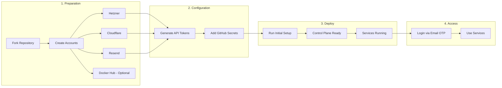
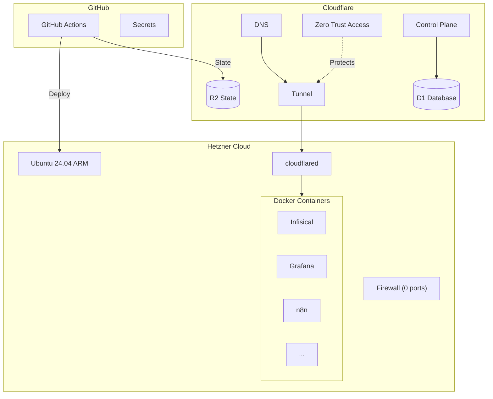
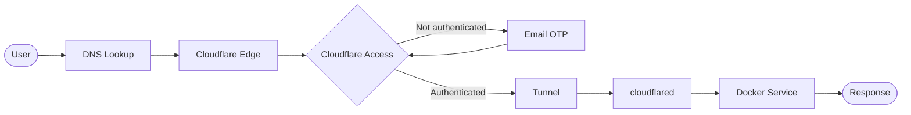

# Nexus-Stack


🚀 **One-command deployment: Hetzner server + Cloudflare Tunnel + Docker - fully automated via GitHub Actions.**

> ⚠️ **Disclaimer:** This project is currently under active development. Use at your own risk. While care has been taken to ensure security, you are responsible for reviewing the code and understanding what it does before running it.

> 📋 **Deployment Method:** This project uses **GitHub Actions exclusively**. Local deployment is not supported as it bypasses the Control Plane architecture.

## What This Does

### Infrastructure
- **Hetzner Cloud Server** - ARM-based (cax11/cax31) running Ubuntu 24.04
- **Cloudflare Tunnel** - All traffic routed through Cloudflare, zero open ports
- **Cloudflare Access** - Email OTP authentication for all services
- **Remote State** - OpenTofu state stored in Cloudflare R2

### Automation
- **Control Plane** - Web UI to manage infrastructure (spin up, teardown, services)
- **GitHub Actions** - Full CI/CD deployment without local tools
- **Scheduled Teardown** - Optional daily auto-shutdown to save costs (with configurable policy to prevent users from disabling it)
- **Email Notifications** - Credentials and status emails via Resend

### Security
- **Zero Entry** - Zero open ports = Zero attack surface
- **Service Tokens** - Headless SSH access for CI/CD
- **Secrets Management** - Centralized in Infisical with auto-provisioning

### Developer Experience
- **GitHub Actions Only** - No local tools required, fully automated deployment
- **Modular Stacks** - Enable/disable services via Control Plane
- **Auto-Setup** - Admin users created automatically with generated passwords
- **Info Page** - Dashboard with all service URLs and credentials

## Prerequisites

- **[Hetzner Cloud](https://console.hetzner.cloud/) account** - For the server
- **[Cloudflare](https://cloudflare.com) account** - Free tier is sufficient
- **[Resend](https://resend.com) account** - For email notifications (credentials, status updates)
- **A domain** - Must be [added to Cloudflare](https://developers.cloudflare.com/fundamentals/setup/manage-domains/add-site/) (Cloudflare manages DNS)
- **[Docker Hub](https://hub.docker.com) account** *(optional)* - Increases pull rate limits for Docker images

## Getting Started

→ See the **[Setup Guide](docs/setup-guide.md)** for complete installation instructions.

After deployment you'll have:
- `https://control.yourdomain.com` - Control Plane to manage infrastructure
- `https://info.yourdomain.com` - Service dashboard with credentials

### Quick Start Flow



## Available Stacks


| Stack | Description | Website |
|-------|-------------|--------|
| **IT-Tools** | Collection of handy online tools for developers | [it-tools.tech](https://it-tools.tech) |
| **Excalidraw** | Virtual whiteboard for sketching hand-drawn diagrams | [excalidraw.com](https://excalidraw.com) |
| **Portainer** | Docker container management UI | [portainer.io](https://www.portainer.io) |
| **Uptime Kuma** | A fancy self-hosted monitoring tool | [uptime.kuma.pet](https://uptime.kuma.pet) |
| **Infisical** | Open-source secret management platform | [infisical.com](https://infisical.com) |
| **Grafana** | Full observability stack with Prometheus, Loki & dashboards | [grafana.com](https://grafana.com) |
| **Hoppscotch** | Open-source API testing platform (Postman alternative) | [hoppscotch.io](https://hoppscotch.io) |
| **Kafka-UI** | Modern web UI for Apache Kafka / Redpanda management | [kafka-ui.provectus.io](https://docs.kafka-ui.provectus.io/) |
| **Kestra** | Modern workflow orchestration for data pipelines & automation | [kestra.io](https://kestra.io) |
| **n8n** | Workflow automation tool - automate anything | [n8n.io](https://n8n.io) |
| **Marimo** | Reactive Python notebook with SQL support | [marimo.io](https://marimo.io) |
| **Mailpit** | Email & SMTP testing tool - catch and inspect emails | [mailpit.axllent.org](https://mailpit.axllent.org) |
| **Metabase** | Open-source business intelligence and analytics tool | [metabase.com](https://www.metabase.com) |
| **Meltano** | Open-source data integration platform for building modular data pipelines | [meltano.com](https://meltano.com) |
| **Redpanda** | Kafka-compatible streaming platform with Console UI | [redpanda.com](https://redpanda.com) |
| **Redpanda Connect** | Declarative data streaming framework for real-time pipelines | [redpanda.com](https://redpanda.com) |
| **Redpanda Datagen** | Test data generator for Redpanda topics | [redpanda.com](https://redpanda.com) |
| **CloudBeaver** | Web-based database management tool | [dbeaver.com/cloudbeaver](https://dbeaver.com/cloudbeaver/) |
| **Mage** | Modern data pipeline tool for ETL/ELT workflows | [mage.ai](https://mage.ai) |
| **MinIO** | S3-compatible object storage for data lakes & backups | [min.io](https://min.io) |
| **Wetty** | Web-based SSH terminal - access server terminal from any browser | [GitHub](https://github.com/butlerx/wetty) |
| **Info** | Landing page with service overview dashboard | — |

→ See [docs/stacks.md](docs/stacks.md) for detailed stack documentation and how to add new services.

## Control Plane

Manage your Nexus-Stack infrastructure via web interface at `https://control.YOUR_DOMAIN`.

**Features:**
- ⚡ **Spin Up / Teardown** - Start and stop infrastructure with one click
- 🧩 **Services** - Enable/disable services dynamically
- ⏰ **Scheduled Teardown** - Auto-shutdown to save costs
- 📧 **Email Credentials** - Send login credentials to your inbox

## GitHub Actions Workflows

| Workflow | Description |
|----------|-------------|
| **Initial Setup** | One-time setup (Control Plane + Spin Up). Supports `enabled_services` parameter to pre-select services. |
| **Spin Up** | Re-create infrastructure after teardown |
| **Teardown** | Teardown infrastructure (keeps state) |
| **Destroy All** | Delete everything |
| **Cleanup Orphaned Resources** | Manual cleanup of orphaned Cloudflare resources |

**Pre-select services during Initial Setup:**
```bash
gh workflow run initial-setup.yaml -f enabled_services="grafana,n8n,portainer"
```

→ See [docs/setup-guide.md](docs/setup-guide.md) for configuration details.

## Architecture



## Security

This setup achieves **zero open ports** after deployment:

1. During initial setup, SSH (port 22) is temporarily open
2. OpenTofu installs the Cloudflare Tunnel via SSH
3. After tunnel is running, SSH port is **automatically closed** via Hetzner API
4. All future SSH access goes through Cloudflare Tunnel

**Result:** No attack surface. All traffic flows through Cloudflare.



- Services are protected by Cloudflare Access (email OTP)
- Set `public = true` in config if you want a service publicly accessible

## Documentation

| Document | Description |
|----------|-------------|
| [Setup Guide](docs/setup-guide.md) | Complete installation and configuration |
| [Control Plane Guide](docs/control-plane.md) | How to use the Control Plane web interface |
| [Stacks](docs/stacks.md) | Available services and how to add new ones |
| [Contributing](docs/CONTRIBUTING.md) | How to contribute to the project |

## How It Works

**Read the full story behind Nexus-Stack:**

**[Nexus-Stack: Your Data, Your Rules, Your Flow](https://stefanko-ch.medium.com/nexus-stack-your-data-your-rules-your-flow-46b29abc062d)**

For a detailed technical explanation of how this infrastructure works under the hood - including the Docker deployment on Hetzner and the Cloudflare Zero Trust Tunnel security setup - check out this article:

**[Secure Hetzner Docker Deployment via Cloudflare Zero Trust Tunnel](https://medium.com/@stefanko-ch/secure-hetzner-docker-deployment-via-cloudflare-zero-trust-tunnel-8f716c4631ce)**

## Project Website

Learn more about Nexus-Stack and explore the full documentation:

**[https://nexus-stack.ch/](https://nexus-stack.ch/)**

## License

[MIT](LICENSE)
