# Nexus Stack Deployment Flow

This document outlines the high-level flow for deploying the Nexus Stack, illustrating how the components interact during the provisioning and runtime phases.

## Deployment Architecture

```mermaid
flowchart TD
    %% Styles
    classDef cloud fill:#e1f5fe,stroke:#01579b,stroke-width:2px
    classDef github fill:#f3f3f3,stroke:#333,stroke-width:2px
    classDef hetzner fill:#ffebee,stroke:#c62828,stroke-width:2px
    classDef secure fill:#e8f5e9,stroke:#2e7d32,stroke-width:2px,stroke-dasharray: 5 5

    %% Actors
    User([👤 User / Admin])
    
    %% GitHub Ecosystem
    subgraph GitHub_Ecosystem [GitHub Ecosystem]
        Repo[📄 Nexus-Stack Repository]
        GA[⚙️ GitHub Actions Runner]
    end
    
    %% Cloudflare
    subgraph Cloudflare_Eco [Cloudflare Platform]
        CF_R2[(🗄️ R2 State Storage)]
        CF_Edge[☁️ Cloudflare Edge]
        CF_Access[🛡️ Cloudflare Access]
        CF_Tunnel_Svc[🚇 Tunnel Service]
    end
    
    %% Hetzner Infrastructure
    subgraph Hetzner_Infra [Hetzner Cloud]
        Firewall[🧱 Cloud Firewall]
        
        subgraph VPS [Ubuntu VPS]
            Cloudflared[Daemon: cloudflared]
            Docker[🐳 Docker Engine]
            
            subgraph Services [Deployed Stacks]
                Control[Control Plane]
                App1[Apps: IT-Tools, etc.]
            end
        end
    end

    %% Apply Styles
    class GitHub_Ecosystem,Repo,GA github
    class Cloudflare_Eco,CF_R2,CF_Edge,CF_Access,CF_Tunnel_Svc cloud
    class Hetzner_Infra,VPS,Firewall,Docker hetzner
    class Cloudflared,Control,App1,Services secure

    %% --- THE FLOW ---

    %% 1. Trigger
    User -->|1. Triggers| GA
    Repo -.->|Source| GA

    %% 2. Provisioning
    GA -- "2. Provisions (OpenTofu)" --> VPS
    GA -- "State Mgmt" --> CF_R2
    
    %% 3. Configuration
    GA -- "3. Configures" --> Firewall
    Firewall -- "Blocks Inbound" --> VPS
    
    GA -- "4. Installs" --> Docker
    GA -- "5. Deploys Agent" --> Cloudflared
    
    %% 4. Runtime
    Cloudflared <== "6. Outbound Tunnel" ==> CF_Tunnel_Svc
    CF_Tunnel_Svc --- CF_Edge
    
    %% 5. Services
    Docker --- Services
    Services -.->|Local Traffic| Cloudflared
    
    %% 6. Access
    User -.->|7. HTTPS Access| CF_Edge
    CF_Edge -- "8. Auth" --> CF_Access
    CF_Access -.->|9. Allowed| CF_Tunnel_Svc
```

## Detailed Process Description

1.  **Trigger**: The user initiates the "Initial Setup" or "Spin Up" workflow from GitHub Actions.
2.  **Provisioning**: The runner uses OpenTofu (Terraform fork) to request a server (VPS) from Hetzner Cloud. State files are stored securely in Cloudflare R2.
3.  **Security Hardening**: OpenTofu configures the Hetzner Firewall to temporarily allow SSH, then blocks **all** inbound ports once the tunnel is active.
4.  **Software Installation**: Docker and the Cloudflared daemon are installed on the VPS.
5.  **Tunnel Establishment**: The `cloudflared` daemon creates an encrypted, outbound-only tunnel to Cloudflare's edge network. No port forwarding is required.
6.  **Service Deployment**: Docker containers (Stacks) are launched. They listen only on `localhost` or an internal Docker network.
7.  **Access**: Traffic flows from the User -> Cloudflare Edge -> Tunnel -> VPS -> Docker Container, protected by Cloudflare Access authentication.
