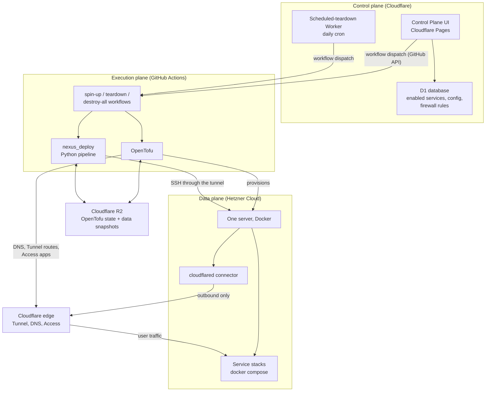

# Architecture

A Nexus Stack deployment has three planes that never merge: a **control plane** you
click, an **execution plane** that runs every change, and a **data plane** — the
server your services actually run on. Nothing you do in the first plane touches the
third directly.

## GitHub Actions is the only execution path

Every infrastructure change — first setup, spin-up, teardown, destroy — runs as a
GitHub Actions workflow. Local deployment is not supported, and that is a design
decision rather than a missing feature:

- The Control Plane's authority comes from being able to dispatch those workflows.
  A second, local path around it would make the D1 state and the real
  infrastructure diverge silently.
- The credentials that can create servers and DNS records live as repository
  secrets and are only ever read by the runner. Nothing on the deployed server can
  reach them.
- Every change has a log, attached to a run, that someone else can read afterwards.

The Control Plane therefore does not deploy anything. It writes desired state into
D1 and calls the GitHub API to dispatch a workflow; the workflow reads that state
and reconciles reality with it.

## OpenTofu owns the infrastructure

OpenTofu (a Terraform fork) creates the Hetzner server, the Cloudflare Tunnel, DNS
records, Access applications and policies, and the generated service passwords. Its
state lives in a Cloudflare R2 bucket, not on anyone's laptop, which is what makes
the same deployment manageable from any workflow run.

Two OpenTofu roots exist, deliberately separated:

- `tofu/control-plane/` — the Control Plane itself: Pages project, Worker, D1
  database, its Access policy. Long-lived.
- `tofu/stack/` — the server, tunnel, DNS, Access apps for services, firewall.
  Created and destroyed on every lifecycle cycle.

That split is why a teardown can destroy the whole environment while the UI that
brings it back stays up.

## nexus_deploy does everything OpenTofu cannot

Provisioning a server is declarative; getting 80 containers into a working state is
not. The `nexus_deploy` Python package (`src/nexus_deploy/`, entry point
`python -m nexus_deploy run-pipeline`) runs after `tofu apply` and, in order:

1. Loads R2 credentials and reads the OpenTofu outputs — secrets, image versions,
   enabled services, firewall rules, the SSH service token, the server IP.
2. Opens an SSH connection *through the Cloudflare Tunnel* and installs the few
   host-level tools it needs.
3. Restores the filesystem data from R2 onto the server's local disk.
4. Brings the enabled stacks up with Docker Compose.
5. Restores the Postgres dumps into the now-running database containers.
6. Runs the per-service configuration phases — seeding repositories, syncing
   secrets from Infisical into the stacks that consume them, and so on.

The order matters and is not accidental: data must be on disk *before* the
containers that own it start, and the databases must be running before their dumps
can be loaded. It replaced the earlier `scripts/deploy.sh`; see
[Migration to Python](../admin-guides/migration-to-python.md) for that history.

## The server

One Hetzner Cloud server runs Docker and nothing else of consequence. Each enabled
service is a Docker Compose stack from `stacks/<name>/docker-compose.yml`, attached
to a shared `app-network`. Service data that must survive lives under a bind-mounted
path on the local SSD; that path is what gets synced to R2 on teardown.

Server type and location are configurable and the spin-up picks from a preference
list rather than a single fixed type, because Hetzner capacity for any one type in
any one region regularly runs out. The [Setup Guide](../admin-guides/setup-guide.md)
has the current defaults.

## Cloudflare is the entire front door

There is no reverse proxy on the server and no public IP that serves HTTP. Instead:

- `cloudflared` runs on the server and opens an **outbound** connection to
  Cloudflare. Traffic only ever flows in over a connection the server itself
  established.
- Each enabled service gets a DNS `CNAME` pointing at the tunnel, and a tunnel
  route mapping `service.yourdomain.com` to `localhost:<port>` on the server.
- Each private service gets a Cloudflare Access application with an email OTP
  policy in front of it.

Which means TLS, DNS, and authentication are all handled before a request reaches
your server — and a service that is not routed simply does not exist from the
outside. [Security model](./security-model.md) goes into what that does and does not
protect you from.

## Where state lives

Nexus Stack keeps four kinds of state, in four different places, and knowing which
is which explains most of its behaviour:

| State | Lives in | Survives teardown |
|---|---|---|
| Infrastructure state (what exists) | OpenTofu state in R2 | Yes |
| Desired configuration (which services are on, firewall rules, lifecycle mode) | Cloudflare D1, written by the Control Plane | Yes |
| Service credentials (database passwords, admin logins) | Infisical on the server, regenerated by OpenTofu | Regenerated |
| Service data (repositories, uploads, database contents) | Server SSD, snapshotted to R2 | Yes, for covered stacks — see [Lifecycle](./lifecycle.md) |

Infrastructure credentials — the Hetzner and Cloudflare API tokens — are in none of
those. They are repository secrets, readable only by the workflow runner.

## Related reading

- [Lifecycle](./lifecycle.md) — what spin-up and teardown actually do
- [Stacks and services](./stacks.md) — what a stack is made of
- [Setup Guide](../admin-guides/setup-guide.md) — the operator's step-by-step
- [Debugging](../admin-guides/debugging.md) — where the logs are when this goes wrong
