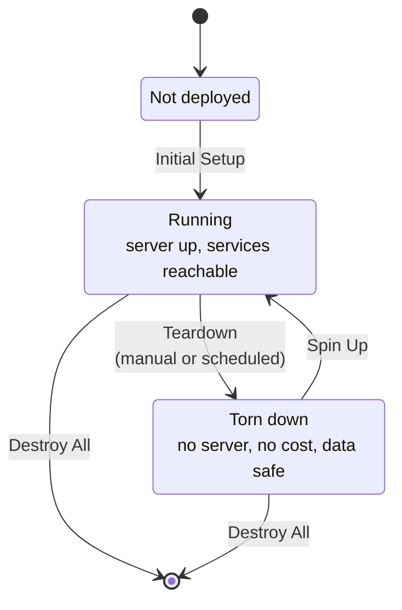

# Lifecycle

Most self-hosted setups have one state: running. Nexus Stack has three, and moving
between them is routine rather than exceptional.

The property to internalise: **the server is disposable, the data is not.** A
teardown really does destroy the machine. Nothing is paused or suspended — there is
no server left to pay for. Spin-up builds a new one and puts the data back.

## Why it works this way

Two reasons, and both are worth more than the complexity they cost.

**Cost.** A Hetzner server is billed by the hour. An environment that only exists
while somebody uses it — evenings, a class, two days of a workshop — costs a
fraction of one that idles 24/7. That is what turns "a real data stack" into
something a person or a course can afford.

**Reproducibility.** If rebuilding from scratch is a nightly routine, it cannot
quietly break. Configuration that only exists because someone once SSH'd in and
changed it does not survive the next cycle, which means it does not exist. Every
deployment is the deployment the code describes.

## The two lifecycle modes

Which pair of workflows a deployment uses is one setting — `lifecycle_mode` in the
Control Plane's D1 database, changed from the Settings page.

| Mode | Teardown does | Spin-up does | Data coverage |
|---|---|---|---|
| `rebuild` (default) | Snapshot the covered data to R2, then destroy everything | Provision a fresh `ubuntu-26.04` server and restore from R2 | The covered subset only |
| `snapshot` | Take a Hetzner disk snapshot, then destroy only the server | Restore the whole root disk from the image | Every stack on the disk |

`rebuild` is the fallback that always works, including across a server-architecture
change. `snapshot` is faster and covers every stack's data, at the cost of depending
on an image that must still be valid.

**Never dispatch one mode's workflow against a deployment configured for the
other.** A rebuild teardown rotates all service credentials, after which the
snapshot guard correctly refuses the image that was just taken. The full switching
and rollback procedure is in
[Snapshot Lifecycle](../admin-guides/snapshot-lifecycle.md).

## What survives a teardown

This is the question worth being precise about, because the answer is not "your
data" — it is "some of your data, depending on the mode".

**Always, in both modes:**

- Infrastructure state (the OpenTofu state in R2) — how the deployment knows what
  it has.
- Control Plane configuration in D1: which services are enabled, firewall rules,
  the lifecycle mode, the teardown schedule.
- The Control Plane itself. It lives in a separate OpenTofu root precisely so a
  teardown cannot take away the UI that brings the deployment back.

**In `rebuild` mode, service data only for the stacks the R2 layer covers.** That is
a hard-coded list in `src/nexus_deploy/s3_restore.py` (`standard_targets()`) —
currently Forgejo, Gitea, Dify, Metabase, HedgeDoc and Planka, plus a dump of the
shared Postgres database. Two kinds of target sit in that list: a `pg_dump` of a
stack's database, and an rsync of the directories it writes — Forgejo and Gitea
have both, since a forge is repositories as much as it is a database. Read that function rather than trusting a number in a document:
the list grows when someone extends it, and this page will not notice.

Everything else — a topic you created in Redpanda, a dashboard you built in a stack
outside the list, files written inside a container — is **gone** on teardown. Not
corrupted, not recoverable: the disk it lived on no longer exists.

**In `snapshot` mode, everything on the root disk survives**, because the whole disk
is imaged. That is the main reason to switch.

**Service credentials are regenerated, not preserved.** OpenTofu creates fresh
passwords on every spin-up and pushes them to Infisical. A password you wrote down
last week is not the password today; the Control Plane and Infisical always have the
current one.

## Scheduled teardown

A Cloudflare Worker runs daily and tears the deployment down if scheduled teardown
is enabled — the mechanism behind the "only pay for the hours you use" property. An
administrator policy can prevent the users of a deployment from switching it off,
which matters when the person paying the bill is not the person using the stack.

Spin-up stays manual: the deployment comes back when somebody asks for it, not on a
timer.

## Teardown is not Destroy All

| | Teardown | Destroy All |
|---|---|---|
| Server | Destroyed | Destroyed |
| Cloudflare Tunnel, DNS, Access apps | Destroyed | Destroyed |
| Control Plane, D1 configuration | Kept | Destroyed |
| R2 buckets (data snapshots, OpenTofu state) | Kept | Kept, unless you opt in to wiping them |
| Coming back | Spin Up | Initial Setup, from scratch |

Destroy All requires typing `DESTROY` to confirm, and wiping the R2 buckets and
Hetzner disk snapshots is a second, separate opt-in — so an accidental full
destruction still leaves the data behind.

## Practical consequences

- **Do not treat a running server as storage.** If it matters, it belongs in a
  covered stack, in a Git repository, or in R2.
- **Do not configure by hand over SSH.** The next spin-up will not know about it.
  Configuration belongs in the repository.
- **Test the cycle early.** A teardown and spin-up on day one tells you what your
  deployment actually preserves, at a point where losing it costs nothing.

## Related reading

- [Snapshot Lifecycle](../admin-guides/snapshot-lifecycle.md) — switching modes, and rolling back
- [Architecture](./architecture.md) — what runs during a spin-up
- [Stacks and services](./stacks.md) — which stacks hold data in the first place
